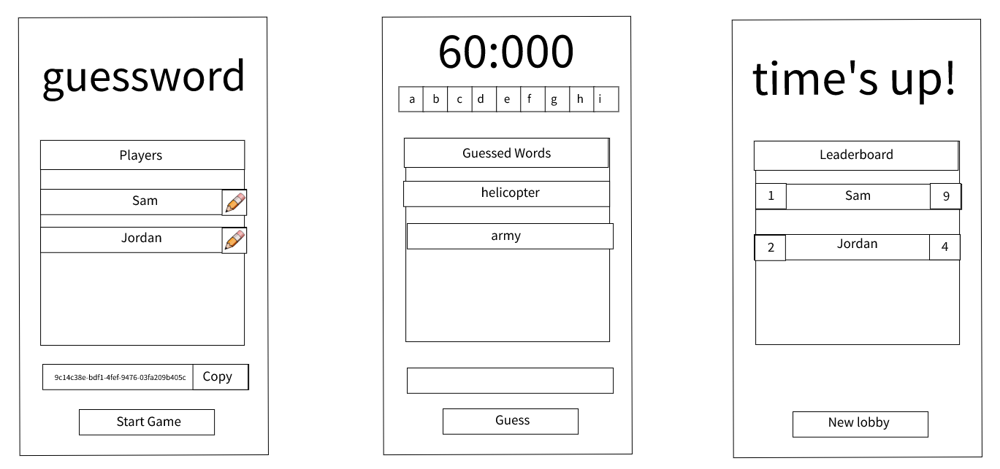

# Guess the Word Multiplayer Game

_guesswork...guessword_ geddit? Okay I'll admit it, I'm bad with names.

## Summary

Live preview: https://guessword-game.vercel.app/

Thanks for the fun take-home exercise! I appreciate and respect companies who opt for take-home assessments instead of archaic whiteboard interviews. Take-homes are much more realistic, which helps paint a better picture of your candidate's overall skills.

My wireframe sketch:

I used only React and react-router-dom, to keep things short and simple.

## Logic

1. When you visit the root directory /, a new lobby is generated and the user is redirected there as the host.
2. If you visit /:gameId, you are brought to the lobby (if exists), otherwise a new lobby is created with the given name.

## Set-up intructions

1. `pnpm i`
2. `pnpm start`
3. Navigate to http://localhost:3000/
